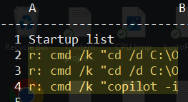
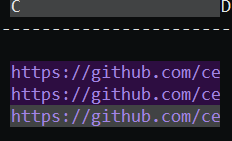
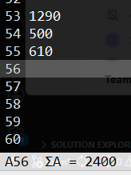
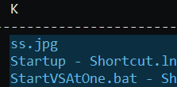

# QuickSheet

**Your desktop is a spreadsheet.**

QuickSheet replaces your wallpaper with a transparent, interactive grid. Pin notes, launch apps, track tasks — all without opening a window. I wanted to give a always present feeling, there is always something lightweight in the background to achieve things. I normally find the default desktop experience pretty useless. 


## Disclaimers

This repo contains lots of AI coding, so I can't attest for the code quality. It's meant to be a side project. I'm however taking the time to ensure it has no downstream dependencies, I wanted to be cognizant of supply chain attacks. So download locally and build locally (shouldn't need any packages for the moment.) 

I also highly recommend setting it as a startup application, this way every time there is a restart you have your notes etc. 

## Quick Start

I recommend running in release mode so things feel snappier. 

```bash
git clone https://github.com/cemheren/QuickSheet.git
cd QuickSheet
dotnet run -c Release --desktop
```

Requires [.NET 9 SDK](https://dotnet.microsoft.com/download/dotnet/9.0).

## Desktop environment for developers 
### Type directly into cells 
For quick notes, todos. Everything autosaves every 5 seconds. You can point and click to any part of your desktop to take some quick notes, use it as a buffer etc without losing focus of the application you are running. 
  
### Launcher
<!--  -->
Prefix any cell with `r: ` to make it a runnable command — e.g. `r: code .` or `r: firefox`.
You can open or launch multiple repos with a single operation. Multi select cells, and hit enter to run. 

I've used it to start the repos I want to work on for the day, and launch copilot with some saved prompts like summarize emails. Not sure how others solve this problem, but this to me is simpler than running startup scripts. 



### Hyper-Link Dashboard
<!--  -->
Paste URLs into cells. They're highlighted and open in your browser on Enter/double-click.
Similar to the launcher funcitonality you can open and run multiple by selecting multiple cells. I was going for a emacs buffer type of feel to save and run multiple cells. 



### Lightweight Data Tracking
<!--  -->
Auto-sum (Σ) per column and auto-product (Π) per row in the status bar. Import/export CSV. I hate opening the calculator for simple operations. This helps with that. 



<!-- 
## Add your own sections here!
Some ideas:
- Daily standups / sprint tracking
- Monitoring dashboard with r: commands
- Project-specific bookmarks
-->

### Desktop files
Desktop files are added to cells (padded to right), which can be used in a multi-select way. Helpful for finding/launching multiple files. Not sure about usability of these yet, likely I'm going to tweak this. 



## Keyboard Shortcuts

| Shortcut | Action |
|----------|--------|
| Arrow Keys | Navigate cells |
| F2 | Edit cell in status bar |
| Enter | Open file / URL / command |
| Ctrl+S | Save to CSV |
| Ctrl+C / X / V | Copy / Cut / Paste |
| Shift+Arrow | Extend selection/Multi select |
| Ctrl+D | Delete row |
| Ctrl+O and Ctrl+P | Insert row |
| Ctrl+Q | Quit |

## License

MIT
