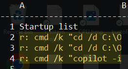
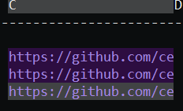

# QuickSheet

**Your desktop is a spreadsheet.**

QuickSheet replaces your wallpaper with a transparent, interactive grid. Pin notes, launch apps, paste links, track numbers — all without opening a window. The idea: keep something lightweight always present in the background, instead of a static wallpaper you never interact with.




## Why this exists

Most developers have a second monitor — or at least a desktop — that shows a static wallpaper doing nothing. QuickSheet turns that dead space into something useful:

- **Always-on scratchpad.** Click anywhere on the desktop to jot a note. No window to find, no app to open. Autosaves every 5 seconds.
- **App launcher.** Prefix a cell with `r: code .` and hit Enter. Multi-select cells to launch your whole morning stack in one keystroke.
- **Link dashboard.** Paste URLs into cells. They're highlighted and open on Enter — a personal start page that lives behind your windows.
- **Live data.** Column sums, sparklines, inline subprocesses (`i: top`), and 40+ extensions for weather, stocks, RSS, system monitoring, and more.
- **Zero dependencies.** Clone → `dotnet build` → run. No NuGet packages, no npm, no Docker. The entire supply chain is the .NET SDK.

If you spend your day in a terminal or IDE and want your desktop to *do* something, QuickSheet is for you.

## Quick Start

```bash
git clone https://github.com/cemheren/QuickSheet.git
cd QuickSheet
dotnet run -c Release --project ExcelConsole.csproj -- --desktop
```

Requires [.NET 9 SDK](https://dotnet.microsoft.com/download/dotnet/9.0). Release mode is recommended — it feels noticeably snappier. Drop `--desktop` to launch in plain TUI mode inside any terminal.

Tip: add it to your startup applications so your notes, links, and launchers are there every time you log in.

Want to export your data? Render any CSV as a GitHub-flavored Markdown table:

```bash
dotnet run --project ExcelConsole.csproj -- mydata.csv --export-md mydata.md
```

New here? The 60-second tour is in [docs/tour.md](docs/tour.md). Or jump straight to [docs/recipes.md](docs/recipes.md) for ready-to-paste dashboard layouts. All keyboard shortcuts are in [docs/keyboard-shortcuts.md](docs/keyboard-shortcuts.md). Common questions: [docs/faq.md](docs/faq.md).

Audience-specific guides: [for homelabbers](docs/for-homelab.md) (Plex / Pi-hole / *arr / Home Assistant on your wallpaper).

## A note on the code

This is a side project, and a lot of it was written with AI assistance. The hard rule the project keeps is **zero NuGet dependencies** — all native interop (X11, WinForms, ConPTY) is hand-written P/Invoke. That keeps the supply-chain surface area minimal: clone, build, run.

## Desktop environment for developers 
### Type directly into cells 
For quick notes, todos. Everything autosaves every 5 seconds. You can point and click to any part of your desktop to take some quick notes, use it as a buffer etc without losing focus of the application you are running. 
  
### Launcher
<!--  -->
Prefix any cell with `r: ` to make it a runnable command — e.g. `r: code .` or `r: firefox`.
You can open or launch multiple repos with a single operation. Multi select cells, and hit enter to run. 

I've used it to start the repos I want to work on for the day, and launch copilot with some saved prompts like summarize emails. Not sure how others solve this problem, but this to me is simpler than running startup scripts. 


### Hyper-Link Dashboard
<!--  -->
Paste URLs into cells. They're highlighted and open in your browser on Enter/double-click.
Similar to the launcher funcitonality you can open and run multiple by selecting multiple cells. I was going for a emacs buffer type of feel to save and run multiple cells. 



### Lightweight Data Tracking
<!--  -->
Auto-sum (Σ) per column and auto-product (Π) per row in the status bar. Import/export CSV. I hate opening the calculator for simple operations. This helps with that. 


### Sparklines in a cell
Prefix a cell with `s: 1,2,3,4,5,6` to render the values as a unicode bar sparkline (`▁▂▃▄▅▆`). Handy for tracking a small series next to other notes — paste a row of numbers, get a tiny chart, no extra column.

You can also point at a range of cells: `s: A1::A10` pulls numeric values from the referenced grid range and renders them. Non-numeric cells in the range are skipped.

<!-- 
## Add your own sections here!
Some ideas:
- Daily standups / sprint tracking
- Monitoring dashboard with r: commands
- Project-specific bookmarks
-->

### Desktop files
Desktop files are added to cells (padded to right), which can be used in a multi-select way. Helpful for finding/launching multiple files. Not sure about usability of these yet, likely I'm going to tweak this. 


## Extensions — Make Your Desktop Do More

QuickSheet has a lightweight extension system that lets you bring new capabilities right into your grid. Extensions are standalone programs that communicate with QuickSheet over a simple JSON-lines protocol — install one in seconds and it just works.

> **Full list:** see [docs/extensions.md](docs/extensions.md) for the live directory of available extensions and the protocol spec.

### Install an extension in one cell

Type `ext: github:user/repo` into any cell and press Enter. QuickSheet clones the repo, reads its manifest, and starts the extension automatically. That's it — no package managers, no config files.

### Example: GitHub Copilot on your desktop

The [quicksheet-copilot-ext](https://github.com/cemheren/quicksheet-copilot-ext) extension brings AI directly into your spreadsheet grid. Ask questions, generate structured data, or summarize cell ranges — all without leaving your desktop.

```
ext: github:cemheren/quicksheet-copilot-ext
copilot: test, 1, 1
```


You can reference cell ranges with `{A1::C10}` syntax and Copilot receives the actual cell contents as context:

```
copilot: summarize this data {B1::E50}, 3, 1
copilot: generate random test data with name and age, 2, 10
```

### Example: Weather forecast widget

The [quicksheet-weather](https://github.com/cemheren/quicksheet-weather) extension turns a cell into a live 7-day weather forecast:

```
ext: github:cemheren/quicksheet-weather
wthr: Seattle, 2, 7
```


### Example: TLS certificate checker

The [quicksheet-tls-ext](https://github.com/cemheren/quicksheet-tls-ext) extension shows TLS cert expiry and issuer — useful as an ambient SRE dashboard:

```
ext: github:cemheren/quicksheet-tls-ext
tls: github.com, 1, 4
```

### More extensions

| Prefix | What it does | Install |
|--------|-------------|---------|
| `price:` | Crypto prices (CoinGecko) | `ext: github:cemheren/quicksheet-price-ext` |
| `def:` | Dictionary lookups | `ext: github:cemheren/quicksheet-define-ext` |
| `mort:` | Mortgage calculator | `ext: github:cemheren/quicksheet-mortgage-ext` |
| `stock:` | Stock quotes (Stooq) | `ext: github:cemheren/quicksheet-stock-ext` |
| `cal:` | Calendar events (.ics) | `ext: github:cemheren/quicksheet-cal` |
| `todo:` | Task management | `ext: github:cemheren/quicksheet-todo` |
| `ping:` | HTTP status & latency | `ext: github:cemheren/quicksheet-ping-ext` |
| `fx:` | Currency conversion | `ext: github:cemheren/quicksheet-fx` |
| `ghpr:` | GitHub PR dashboard | `ext: github:cemheren/quicksheet-ghpr` |
| `docker:` | Container health | `ext: github:cemheren/quicksheet-docker` |
| `gitst:` | Git repo status | `ext: github:cemheren/quicksheet-gitst` |
| `portck:` | TCP port checker | `ext: github:cemheren/quicksheet-portck` |
| `k8s:` | Kubernetes pod status | `ext: github:cemheren/quicksheet-k8s` |
| `cntdn:` | Countdown timers | `ext: github:cemheren/quicksheet-cntdn` |
| `1099:` | US self-employment tax | `ext: github:cemheren/quicksheet-1099-ext` |
| `mileage:` | IRS mileage deduction | `ext: github:cemheren/quicksheet-mileage-ext` |
| `budget:` | Budget envelopes | `ext: github:cemheren/quicksheet-budget` |
| `worldtm:` | World clock / timezones | `ext: github:cemheren/quicksheet-worldtm` |
| `margin:` | Break-even & margin calc | `ext: github:cemheren/quicksheet-margin-ext` |
| `depr:` | Depreciation schedules | `ext: github:cemheren/quicksheet-depr-ext` |
| `jwtdec:` | JWT token decoder | `ext: github:cemheren/quicksheet-jwtdec` |
| `cronck:` | Cron expression parser | `ext: github:cemheren/quicksheet-cronck` |
| `guid:` | GUID/UUID generator | `ext: github:cemheren/quicksheet-guid` |
| `regex:` | Regex pattern explainer | `ext: github:cemheren/quicksheet-regex` |
| `urlenc:` | URL encode/decode | `ext: github:cemheren/quicksheet-urlenc` |
| `health:` | HTTP endpoint health checker | `ext: github:cemheren/quicksheet-health` |

See [docs/extensions.md](docs/extensions.md) for the full directory with descriptions and protocol docs.

### Build your own

Extensions are regular .NET (or any language) programs that read/write JSON lines on stdin/stdout. The protocol is intentionally minimal:

1. QuickSheet sends `{"type":"init"}` → extension replies with `{"type":"register", "prefix":"xyz", ...}`
2. When a user activates a cell matching the prefix, QuickSheet sends `{"type":"activate", ...}` → extension replies with `{"type":"write", "cells":[...]}` to fill the grid.

Ship a `quicksheet-extension.json` manifest in your repo and you're done. See the **[full protocol spec](docs/extension-protocol.md)** for message formats, coordinate system, rules, and working examples in C# and Python. Or check the [weather extension](https://github.com/cemheren/quicksheet-weather) for a minimal working example.

## Keyboard Shortcuts

### Navigation

| Shortcut | Action |
|----------|--------|
| Arrow Keys | Navigate cells |
| Shift+Arrow | Extend selection / multi-select |
| Tab | Move right, wrap to next row |
| Enter | Activate cell (open URL / run command) |

### Editing

| Shortcut | Action |
|----------|--------|
| F2 | Edit cell in-place |
| Backspace | Delete last character / clear selection |
| Delete | Clear cell or selection |
| Escape | Cancel edit |
| Type any character | Start editing the selected cell |

### View & Layout

| Shortcut | Action |
|----------|--------|
| F1 | Toggle raw vs resolved cell display |
| F3 | Rebuild grid / recalculate layout |
| F4 | Decrease column width |
| F5 | Increase column width |

### Clipboard & Search

| Shortcut | Action |
|----------|--------|
| Ctrl+C | Copy cell(s) |
| Ctrl+Shift+C | Copy resolved / displayed content |
| Ctrl+X | Cut cell(s) |
| Ctrl+V | Paste (supports multi-line) |
| Ctrl+F | Search |

### Undo & History

| Shortcut | Action |
|----------|--------|
| Ctrl+Z | Undo last action |
| Ctrl+Y | Redo |

### Appearance

| Shortcut | Action |
|----------|--------|
| Ctrl+T | Cycle theme (Dark → Light → Nord → Solarized → Matrix → Dracula → Synthwave → Gruvbox → Monokai → HotdogStand) |

### File & Row Operations

| Shortcut | Action |
|----------|--------|
| Ctrl+S | Save to CSV |
| Ctrl+D | Delete row |
| Ctrl+O | Insert row below |
| Ctrl+P | Insert row above |
| Ctrl+H | Show help overlay |
| Ctrl+Q | Quit |

## License

MIT
